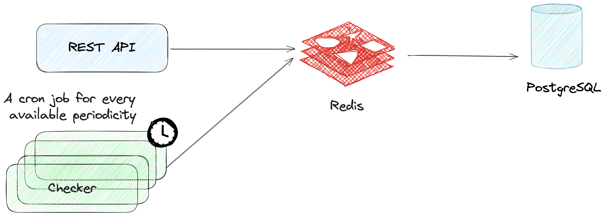
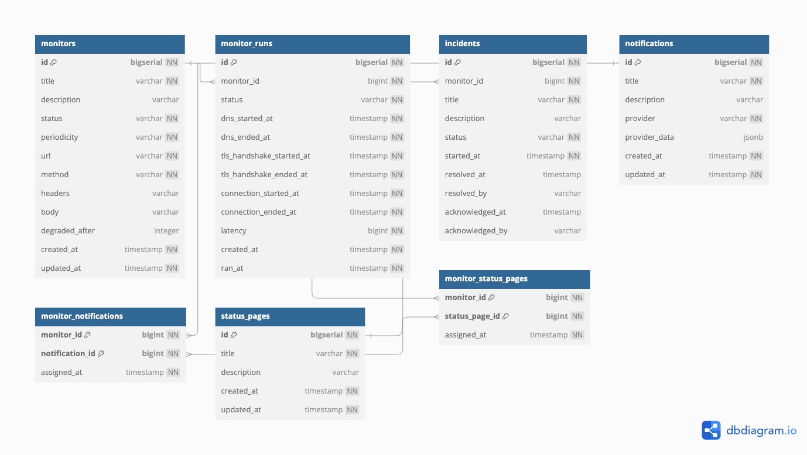

# Uptime API

Uma aplicação que permite com que você crie monitores sintéticos para suas aplicações e sistemas.

Um monitor sintético é uma tarefa que de forma automatizada e feita por um robô, tem o objetivo de checar se algum sistema está funcionando corretamente ou se há algum problema acontecendo.

Fiz esse projeto com o objetivo de aprender Golang, linguagem que estou estudando e aplicando diretamente no meu trabalho.

Os principais desafios que aprendi com esse projeto foram:
- Como funciona a arquitetura do Golang.
- Uso de channels e goroutines.
- CronJobs en Golang.

## Tabela de conteúdos

- [Arquitetura](#arquitetura)
- [Modelo](#modelo)
- [Funcionalidades](#funcionalidades)
- [Executando_o_projeto](#executando-o-projeto)

## Arquitetura

A arquitetura do projeto é bem simples: Uma REST API, uma série de cronjobs, uma instância de PostgreSQL e uma instância de Redis para cache.



## Modelo



Terá um arquivo `main.sql` com o script de criação das tabelas pertinentes ao modelo.

## Executando o projeto

Para rodar o projeto, você vai precisar dos seguintes pré-requisitos:

- **Go** instalado na versão 1.23 ou superior
- **Docker** e **Docker Compose** instalados na máquina que vai executar.

Tendo os pré-requisitos, siga os passos abaixo:

1. Clone o repositório:

```bash
git clone git@github.com:liverday/uptime-api.git
```

2. Entre na pasta do projeto:

```bash
cd uptime-api
```

3. Instale as dependências do módulo:

```bash
go mod download
```

4. Inicie a instância do PostgreSQL e Redis:

```bash
docker-compose up -d db redis
```

5. Copie o arquivo `.env.example` para `.env` dentro da pasta `cmd/api` e faça as devidas substituições:

```bash
APP_PORT=8080

DB_HOST=localhost
DB_PORT=5432
DB_USER=postgres
DB_PASS=password
DB_NAME=uptime

REDIS_HOST=localhost
REDIS_PORT=6379
```

6. Execute o projeto:

```
cd cmd/api &&
go run main.go
```

7. Pronto! O projeto está rodando em `http://localhost:8080`.
